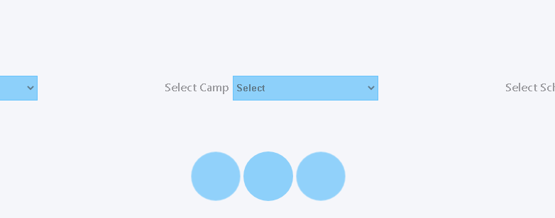
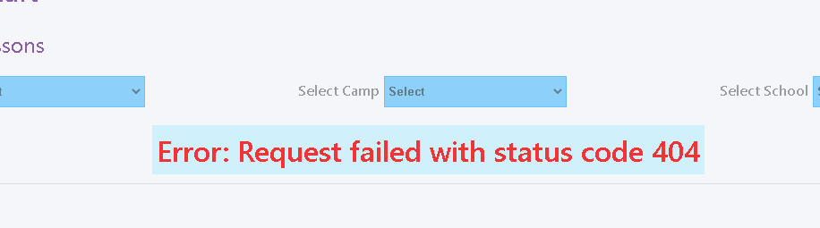
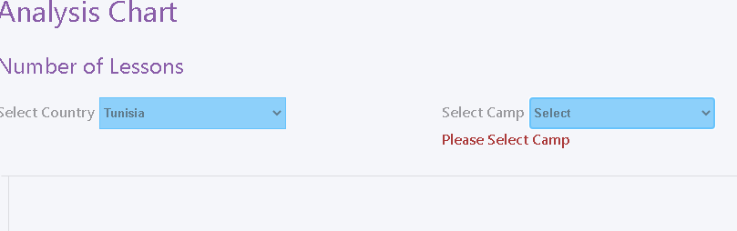
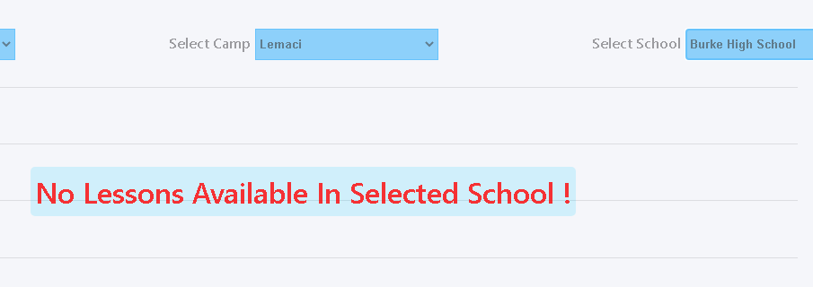
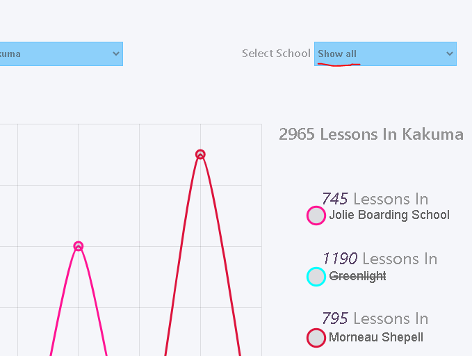
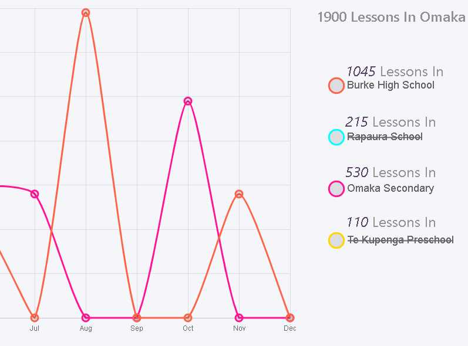
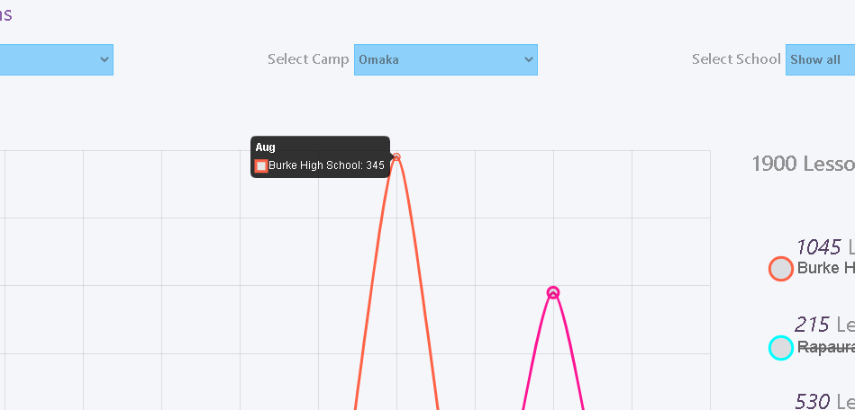
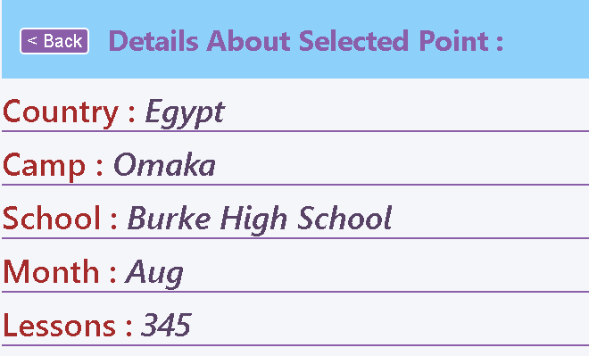

# Analysis Chart App :
#### Basic Usage :
- An application that displays a linear chart of data where the X-Axis shows the months of the year and the Y-Axis shows the No. of lessons per month per school, The data is displayed based on the user selection of desired Country, Camp, and School. 

## Technologies and Libraries :
- HTML5,   CSS3,  JavaScript,  TypeScript
- ReactJS,  React-Redux-Toolkit,  Reacr-Router v6,  Axios
- React-Chart-JS,  React-Spinners,  React-CountUp.

## Live Demo :
https://62ae4805ade8734b2879de9c--analysis-chart-challenge.netlify.app/

## Features :
- #### A loading indicator is displayed while fetching data.

screen-shoots
- ####  An error message is displayed when something goes wrong while fetching data.

- ####  A warning message is displayed if an input is left unselected.

- ####  A message is displayed if no Lessons are available in a selected school.

- ####  A 'Show all' option that shows all the schools available with distinct a color for each school.

- ####  Clicking the colored circles right of the chart toggles the visibility of clicked school on the chart.

- ####  Hovering over any point in the chart shows a tooltip that contains some info about that specific point in the chart.

- ####  Clicking any point in the chart navigates the user to a details page that displays more info about that specific point.
- ####  Details page has a back button that takes the user back to the chart again without changing or reseting his previous selection.

## Notes :
- Data is fetched from a raw JSON file hosted on GitHub.
- The store holds the state for the whole app (useState hook was never used ).
- The given data had 2 different number of lessons at the same month for the same school, my solution was to add them together to get 1 number of lessons for each month for same school.
- UI is not fully responsive as it wasn't my main focus during the the givin time .
- The same color may appear for two different data on the chart because colors are randomly generated and some times same number gets generated for 2 different charts.
- 'Prerrier' was used for code formating.
- TypeScript and Testing are two areas where i'm still improving and learning, so please excuse any shortcomings and unmet requirements that i wasn't able to completely fulfill during the given time.

