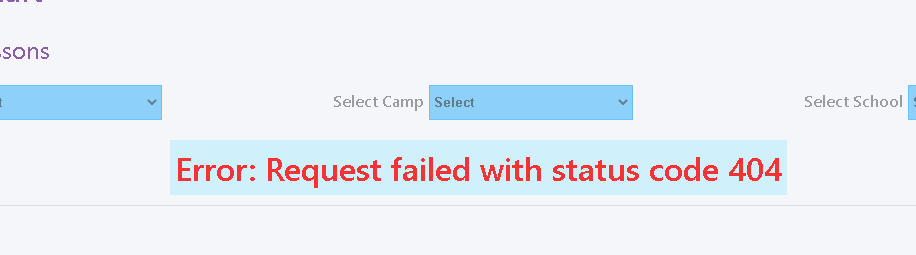
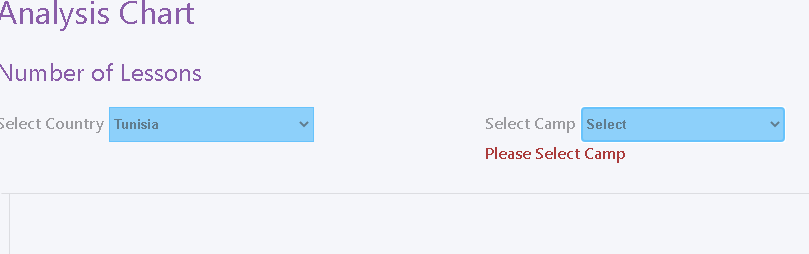
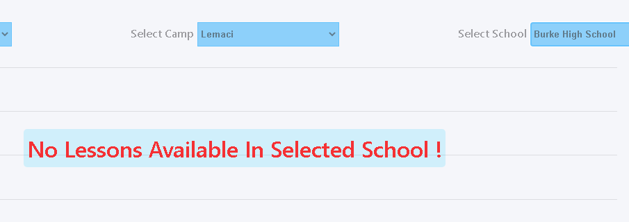

# Analysis Chart App :
#### Basic Usage :
An application that displays a linear chart of data where the X-Axis is the month and the Y-Axis the No. of lessons per month.
The data is displayed based on the user selection of desired Country, Camp, and School. 

## Technologies and Libraries :
#### Technologies : HTML5, CSS3, JavaScript, TypeScript ,ReactJS , React Redux-Toolkit, Reacr Router v6, Axios, ChartJS, React Spinners, React CountUp.

## Features :
- A loading indicator is displayed while fetching data.

screen-shoots
- An error message is displayed when something goes wrong while fetching data.

- A warning message is displayed if an input is left unselected.

- A message is displayed if no Lessons are available in a selected school.

- A 'Show all' option that shows all the schools available with distinct a color for each school.

- Clicking the colored circles right of the chart toggles the visibility of clicked school on the chart.

- Hovering over any point in the chart shows a tooltip that contains some info about that specific point in the chart.

- Clicking any point in the chart navigates the user to a details page that displays more info about that specific point.
- Details page has a back button that takes the user to the chart again without changing or reseting his previous selection.

## Notes :
- Data is fetched from a raw JSON file hosted on GitHub.
- The store holds the state for the whole app (useState hook was never used ).
- Some schools had 2 different number of lessons at the same month the for the same school, my solution was to add them together to get 1 number of lessons for each month for same school.
- UI is not fully responsive as it wasn't my main focus.

